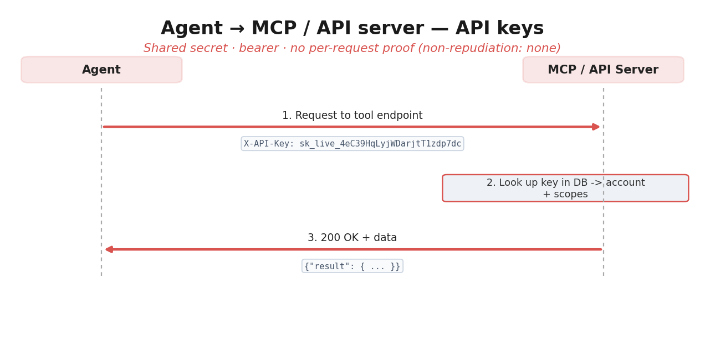
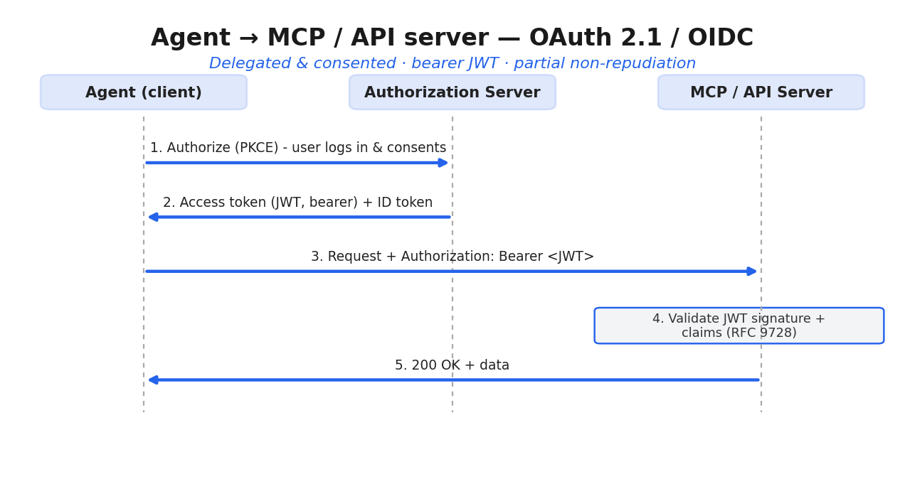
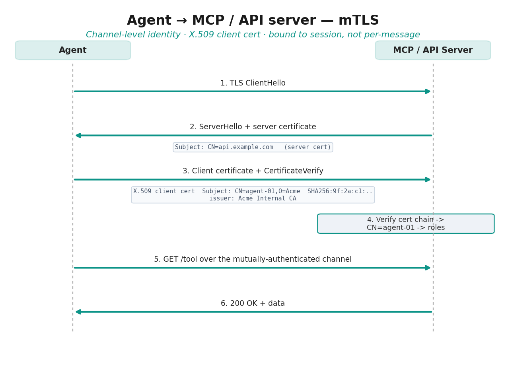
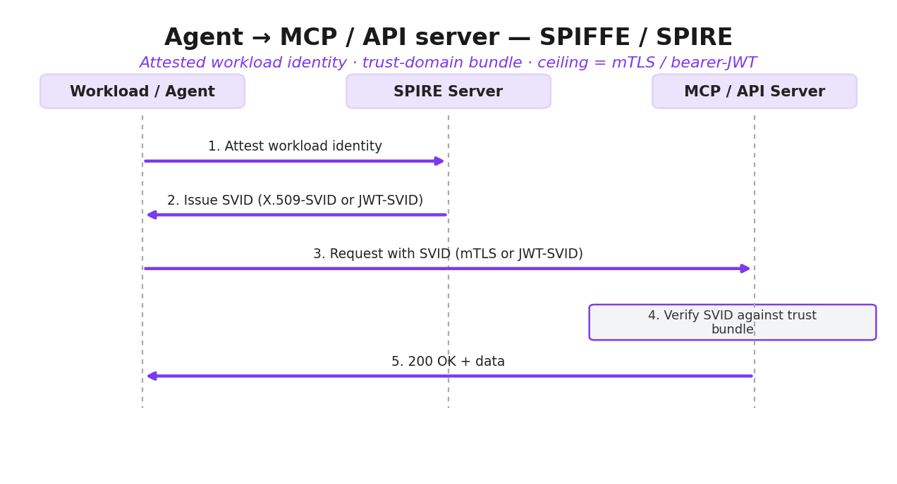
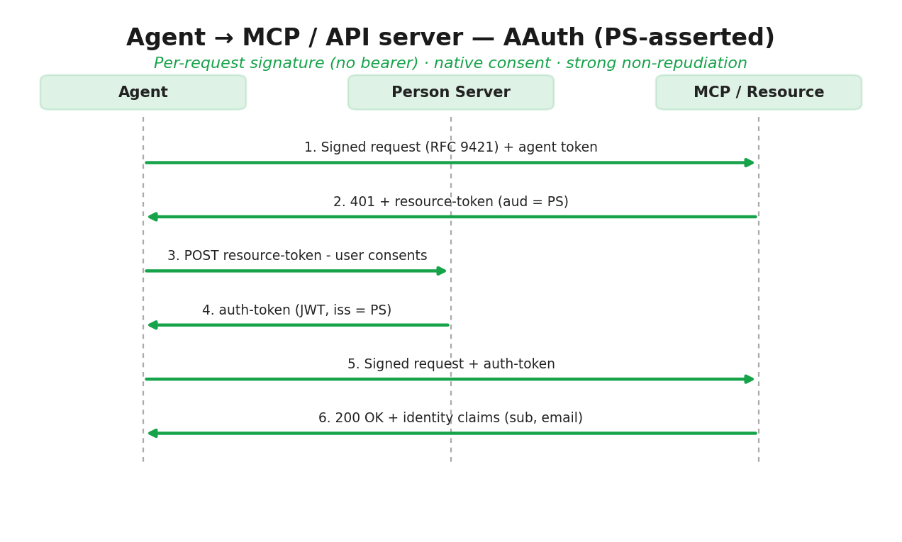

# aauth_research

## Agent auth mechanisms — when to use what

Building up an agent's access to a protected resource (e.g. an MCP server) across four
properties — **identity** (who are you), **authentication** (prove it), **authorization**
(what may you do), and **non-repudiation** (you can't deny you did it, and the server
can't fake that you did) — and where each mechanism lands.

| Mechanism | Identity | Authentication | Authorization | Non-repudiation | Token is a JWT? | Reach for it when |
|---|---|---|---|---|---|---|
| **API keys** | String maps to an account (coarse) | Weak — possession of a *shared* secret, easily stolen | Coarse, server-side scopes tied to the key | **None** — not a signature; logs only | **No** — opaque random string, no structure | Internal/first-party, low-stakes, you own both ends, prototypes |
| **OAuth 2.1 / OIDC** | OIDC ID token = which user; `client_id` = which app | AS mints tokens after a PKCE flow; access token still **bearer** | **Strong & standard** — scopes, consent, revocable, short-lived | Partial (bearer ceiling; DPoP/mTLS adds binding) | **Yes** — ID token always a JWT; access token usually | Human delegates access to a third-party app; **MCP's path today** |
| **mTLS / client certs** | Certificate subject / SAN | Strong — handshake proves private-key possession | Usually external (cert → roles) | Channel-level only, not per-message | **No** — identity is an X.509 certificate (a different signed format) | Service-to-service inside infra you operate |
| **SPIFFE / SPIRE** | SPIFFE ID via workload attestation | SVID — X.509 or JWT | External policy engine | Limited (mTLS / bearer-JWT ceiling) | **Either** — X.509-SVID (no) or JWT-SVID (yes) | Workload identity in a cluster/mesh |
| **AAuth** | Agent identity from a published key + optional person identity via PS | **Per-request RFC 9421 signature** — proves key possession every call; not a bearer | Built-in modes + human consent ceremony; claims like `sub`/`email`/`scope` | **Strong** — each request a detached signature, a durable artifact | **Yes** — agent/resource/auth tokens are all JWTs (`aa-agent+jwt`, etc.) | Cross-org autonomous agents needing non-repudiation + native delegation |

**The "Token is a JWT?" column is independent of how strong the security is.** API keys (no
JWT) and AAuth (all JWTs) sit at opposite ends of the non-repudiation scale, and OAuth and
AAuth both use JWTs yet land in very different places. "Uses JWTs" describes the **encoding**,
not the **strength**.

**What moves the needle is bearer vs. bound.** A stealable **bearer** token (API key,
OAuth/OIDC, JWT-SVID) means possession = use. A token **bound to a key the caller proves
possession of** — mTLS at the channel level, AAuth at the message level — removes that
weakness. AAuth uses the same JWT format as OAuth but stops handing it over as a bearer;
that's the whole difference.

## Workflows — agent to MCP / API server

How the agent reaches a protected MCP / API server under each mechanism, step by step.

### API keys

### OAuth 2.1 / OIDC

### mTLS

### SPIFFE / SPIRE

### AAuth

## OAuth 2.1 / OIDC vs. AAuth — the two flows side by side

Reading the two diagrams above against each other, step for step:

| Aspect | OAuth 2.1 / OIDC | AAuth (PS-asserted) |
|---|---|---|
| **Parties on the wire** | User, Agent, Authorization Server, MCP/API Server (4 actors) | Agent, Person Server, MCP/Resource (3 actors) |
| **How the flow starts** | Agent redirects to `/authorize` with a PKCE `code_challenge` | Agent makes the actual signed request to the resource right away |
| **Where the human consents** | Up front, in a browser at the Authorization Server (step 2) | After the resource asks — agent POSTs the resource-token, person consents at the Person Server |
| **Credential the resource receives** | A **bearer** access-token JWT in `Authorization: Bearer …` | A **per-request RFC 9421 signature** (`Signature` + `Signature-Key`), never handed over as bearer |
| **Token format on the call** | `access_token` JWT (`aud:mcp, scope, exp`) | JWT carried in `Signature-Key`: `aa-agent+jwt`, then person-issued `aa-auth+jwt` |
| **Proof of possession** | None — whoever holds the token can replay it | Signed with the agent's key on **every** request; bound to the caller's key |
| **Round trips before resource is called** | Authorize → consent → code → `/token` exchange, *then* call | Call → 401 + resource-token → consent at PS → re-call with auth-token |
| **What the resource learns** | Claims inside the bearer JWT, validated via JWKS (RFC 9728 metadata) | `sub`, `agent`, `name`, `email` — identity claims asserted by the Person Server |
| **Non-repudiation** | Bearer ceiling — a stolen token is indistinguishable from the real caller | Strong — each request is a detached signature, a durable per-call artifact |

## AAuth access modes — when to use which

AAuth has four resource-access modes (same wire protocol throughout — the difference is which
party mints the auth token). Pick by the single situation each one fits best:

| Mode | Parties | Best use case |
|---|---|---|
| **Identity-Based** | Agent + Resource | Replace API keys with cryptographic agent identity — no extra infrastructure |
| **Resource-Managed** | Two-party | The resource runs its own authorization/consent and wants no external person server or access server |
| **PS-Asserted** | Three-party | The resource trusts identity claims (`sub`, `email`, `tenant`, roles) asserted by any person server |
| **Federated** | Four-party | Cross-domain access where the resource's own access server enforces policy |

Source: <https://explorer.aauth.dev/access/compare>
