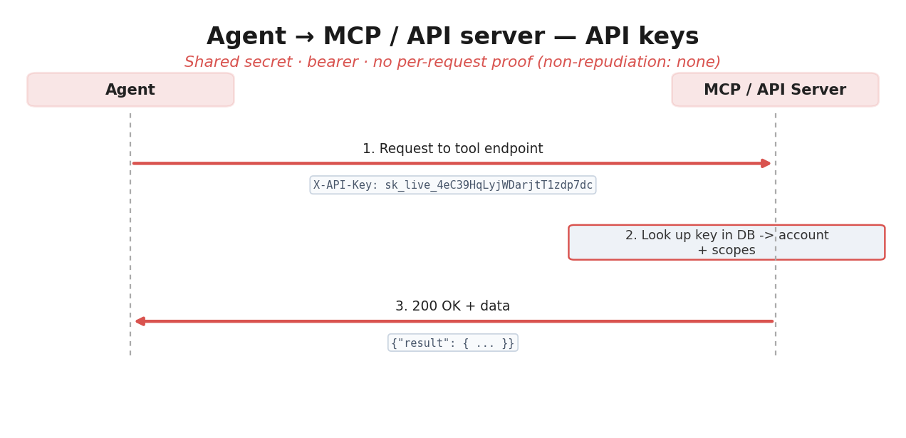
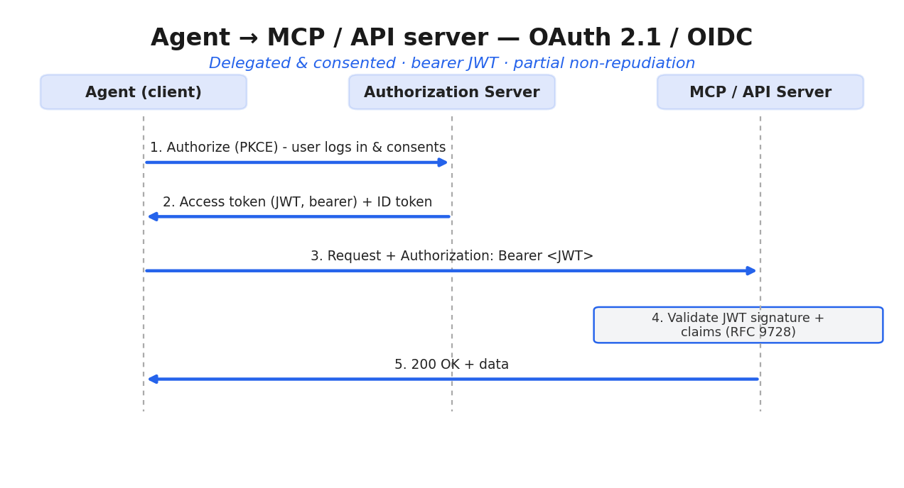
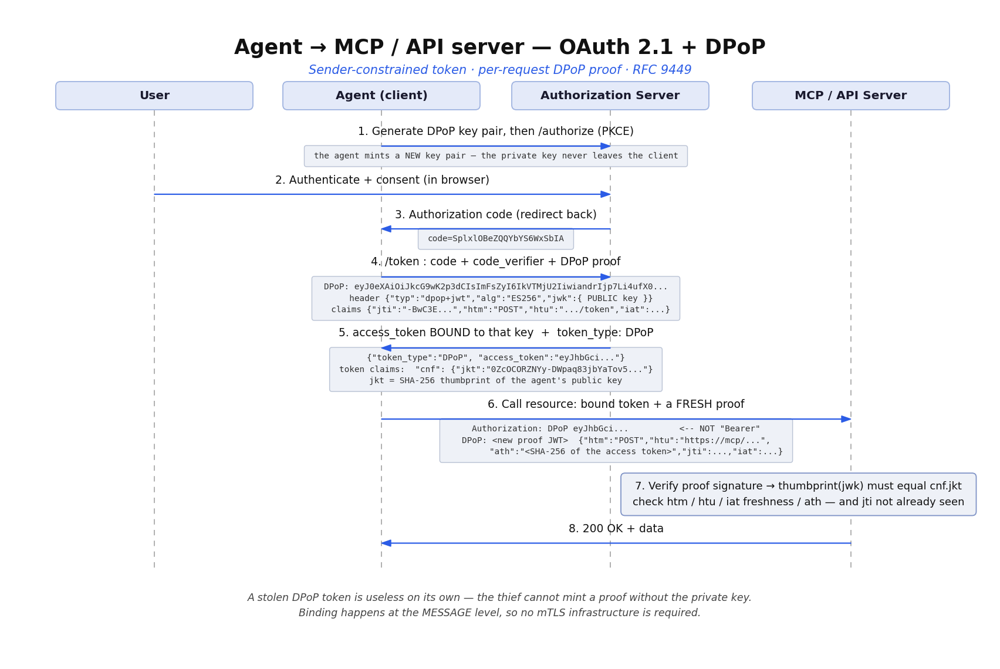
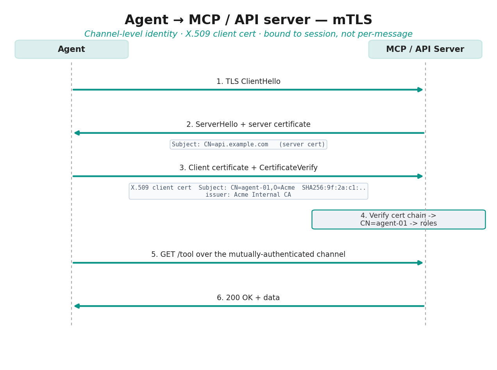
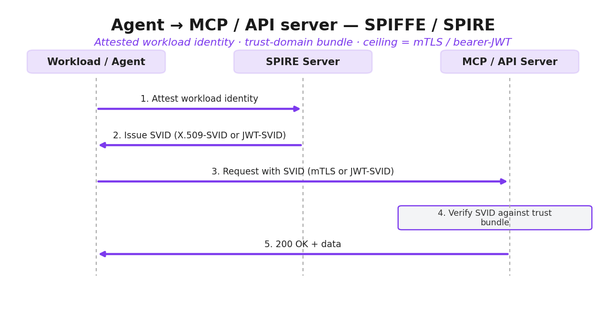
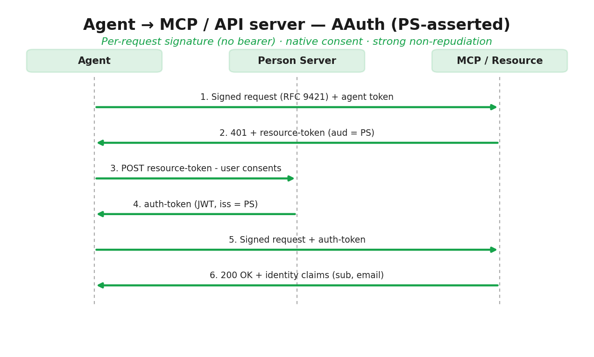

# aauth_research

## Agent auth mechanisms — when to use what

Building up an agent's access to a protected resource (e.g. an MCP server) across four
properties — **identity** (who are you), **authentication** (prove it), **authorization**
(what may you do), and **non-repudiation** (you can't deny you did it, and the server
can't fake that you did) — and where each mechanism lands.

| Mechanism | Identity | Authentication | Authorization | Non-repudiation | Token is a JWT? | Reach for it when |
|---|---|---|---|---|---|---|
| **API keys** | String maps to an account (coarse) | Weak — possession of a *shared* secret, easily stolen | Coarse, server-side scopes tied to the key | **None** — not a signature; logs only | **No** — opaque random string, no structure | Internal/first-party, low-stakes, you own both ends, prototypes |
| **OAuth 2.1 / OIDC** | OIDC ID token = which user; `client_id` = which app | AS mints tokens after a PKCE flow; access token still **bearer** | **Strong & standard** — scopes, consent, revocable, short-lived | Partial (bearer ceiling; DPoP/mTLS adds binding) | **Yes** — ID token always a JWT; access token usually | Human delegates access to a third-party app; **MCP's path today** |
| **OAuth 2.1 + DPoP** | Same as OAuth — `client_id` + OIDC `sub` | Bearer replaced by a **per-request proof JWT**; token bound to the client's key (`cnf.jkt`) | Same OAuth scopes/consent — unchanged | **Good** — a stolen token is unusable, but the proof signs headers, not the body | **Yes** — access token plus a `dpop+jwt` proof per request | You already run OAuth and want sender-constrained tokens **without** mTLS infrastructure |
| **mTLS / client certs** | Certificate subject / SAN | Strong — handshake proves private-key possession | Usually external (cert → roles) | Channel-level only, not per-message | **No** — identity is an X.509 certificate (a different signed format) | Service-to-service inside infra you operate |
| **SPIFFE / SPIRE** | SPIFFE ID via workload attestation | SVID — X.509 or JWT | External policy engine | Limited (mTLS / bearer-JWT ceiling) | **Either** — X.509-SVID (no) or JWT-SVID (yes) | Workload identity in a cluster/mesh |
| **AAuth** | Agent identity from a published key + optional person identity via PS | **Per-request RFC 9421 signature** — proves key possession every call; not a bearer | Built-in modes + human consent ceremony; claims like `sub`/`email`/`scope` | **Strong** — each request a detached signature, a durable artifact | **Yes** — agent/resource/auth tokens are all JWTs (`aa-agent+jwt`, etc.) | Cross-org autonomous agents needing non-repudiation + native delegation |

**The "Token is a JWT?" column is independent of how strong the security is.** API keys (no
JWT) and AAuth (all JWTs) sit at opposite ends of the non-repudiation scale, and OAuth and
AAuth both use JWTs yet land in very different places. "Uses JWTs" describes the **encoding**,
not the **strength**.

**What moves the needle is bearer vs. bound.** A stealable **bearer** token (API key,
OAuth/OIDC, JWT-SVID) means possession = use. A token **bound to a key the caller proves
possession of** — mTLS at the channel level, DPoP and AAuth at the message level — removes that
weakness. AAuth uses the same JWT format as OAuth but stops handing it over as a bearer;
that's the whole difference.

**DPoP ([RFC 9449](https://www.rfc-editor.org/rfc/rfc9449)) is OAuth crossing that same line.**
It keeps the entire OAuth flow and adds a per-request `dpop+jwt` proof signed by a key the client
generates and never sends. The access token carries `cnf.jkt` — a thumbprint of that public key —
so the resource server checks the proof against the token and a stolen token alone is inert. Two
things follow. First, **proof-of-possession is not unique to AAuth**; the useful question is no
longer *"bound or not"* but *what the signature covers, and who can be identified*. Second, DPoP
binds at the **message** level like AAuth rather than the **channel** level like mTLS, which is
why it needs no certificate infrastructure.

Where DPoP and AAuth still differ:

| | OAuth + DPoP | AAuth |
|---|---|---|
| **What the proof covers** | `htm` (method), `htu` (URI), `iat`, `jti`, `ath` (token hash) — **not the body** | RFC 9421 covered components, and any header you include — a `content-digest` can bind the **body** |
| **Who issues identity** | An authorization server you registered with in advance | The agent's **own published key**; person claims come from any trusted person server |
| **Cross-org reach** | Needs a client registration at each AS | Discovery via the agent's published `issuer` / JWKS — no pre-registration |
| **Delegation** | User consent at the AS, scopes in one token | Separate agent and person tokens (`act`), so *which agent acted for which human* stays explicit |
| **Non-repudiation** | Good — but the proof is scoped to one request's method/URI, not its content | Strong — a detached signature over the request, re-verifiable later as a durable artifact |

So DPoP is the **right upgrade if you already run OAuth**: it removes the bearer weakness with no
new infrastructure. AAuth targets the harder case — agents acting **across organizations** with
no pre-registration, where identity must be self-published and delegation must be legible.

## Server-side code — [`src/`](src/)

Runnable MCP servers for each mechanism below, enforcing **authentication** (which MCP client,
which user) and **authorization** (may that pair use this tool / resource / prompt) with **no MCP
gateway** — the server itself is the policy enforcement point. Same policy table and same
primitives throughout, so the only thing that differs is what each mechanism lets the server
learn about its caller. See [`src/README.md`](src/README.md).

## Workflows — agent to MCP / API server

How the agent reaches a protected MCP / API server under each mechanism, step by step.

### API keys

### OAuth 2.1 / OIDC

### OAuth 2.1 + DPoP

Same flow as above, with the bearer weakness removed: the client generates a key pair, proves
possession on every call with a `dpop+jwt`, and the access token is pinned to that key via
`cnf.jkt`.

### mTLS

### SPIFFE / SPIRE

### AAuth

## OAuth 2.1 / OIDC vs. AAuth — the two flows side by side

Reading the two diagrams above against each other, step for step:

| Aspect | OAuth 2.1 / OIDC | AAuth (PS-asserted) |
|---|---|---|
| **Parties on the wire** | User, Agent, Authorization Server, MCP/API Server (4 actors) | Agent, Person Server, MCP/Resource (3 actors) |
| **How the flow starts** | Agent redirects to `/authorize` with a PKCE `code_challenge` | Agent makes the actual signed request to the resource right away |
| **Where the human consents** | Up front, in a browser at the Authorization Server (step 2) | After the resource asks — agent POSTs the resource-token, person consents at the Person Server |
| **Credential the resource receives** | A **bearer** access-token JWT in `Authorization: Bearer …` | A **per-request RFC 9421 signature** (`Signature` + `Signature-Key`), never handed over as bearer |
| **Token format on the call** | `access_token` JWT (`aud:mcp, scope, exp`) | JWT carried in `Signature-Key`: `aa-agent+jwt`, then person-issued `aa-auth+jwt` |
| **Proof of possession** | None — whoever holds the token can replay it | Signed with the agent's key on **every** request; bound to the caller's key |
| **Round trips before resource is called** | Authorize → consent → code → `/token` exchange, *then* call | Call → 401 + resource-token → consent at PS → re-call with auth-token |
| **What the resource learns** | Claims inside the bearer JWT, validated via JWKS (RFC 9728 metadata) | `sub`, `agent`, `name`, `email` — identity claims asserted by the Person Server |
| **Non-repudiation** | Bearer ceiling — a stolen token is indistinguishable from the real caller | Strong — each request is a detached signature, a durable per-call artifact |

## AAuth access modes — when to use which

AAuth has four resource-access modes (same wire protocol throughout — the difference is which
party mints the auth token). Pick by the single situation each one fits best:

| Mode | Parties | Best use case |
|---|---|---|
| **Identity-Based** | Agent + Resource | Replace API keys with cryptographic agent identity — no extra infrastructure |
| **Resource-Managed** | Two-party | The resource runs its own authorization/consent and wants no external person server or access server |
| **PS-Asserted** | Three-party | The resource trusts identity claims (`sub`, `email`, `tenant`, roles) asserted by any person server |
| **Federated** | Four-party | Cross-domain access where the resource's own access server enforces policy |

Source: <https://explorer.aauth.dev/access/compare>

## Sources

- **AAuth access modes** — <https://explorer.aauth.dev/access/compare>
- **DPoP** — <https://oauth.net/2/dpop/> · spec: [RFC 9449, *OAuth 2.0 Demonstrating Proof of
  Possession*](https://www.rfc-editor.org/rfc/rfc9449)
- **OAuth 2.1** — <https://oauth.net/2.1/> · **OIDC** — <https://openid.net/developers/how-connect-works/>
- **mTLS-bound tokens** — [RFC 8705, *OAuth 2.0 Mutual-TLS Client Authentication and
  Certificate-Bound Access Tokens*](https://www.rfc-editor.org/rfc/rfc8705)
- **HTTP message signatures** (what AAuth signs with) — [RFC
  9421](https://www.rfc-editor.org/rfc/rfc9421)
- **Protected resource metadata** (how an MCP client discovers the AS) — [RFC
  9728](https://www.rfc-editor.org/rfc/rfc9728)
- **SPIFFE / SPIRE** — <https://spiffe.io/docs/latest/spiffe-about/overview/>
